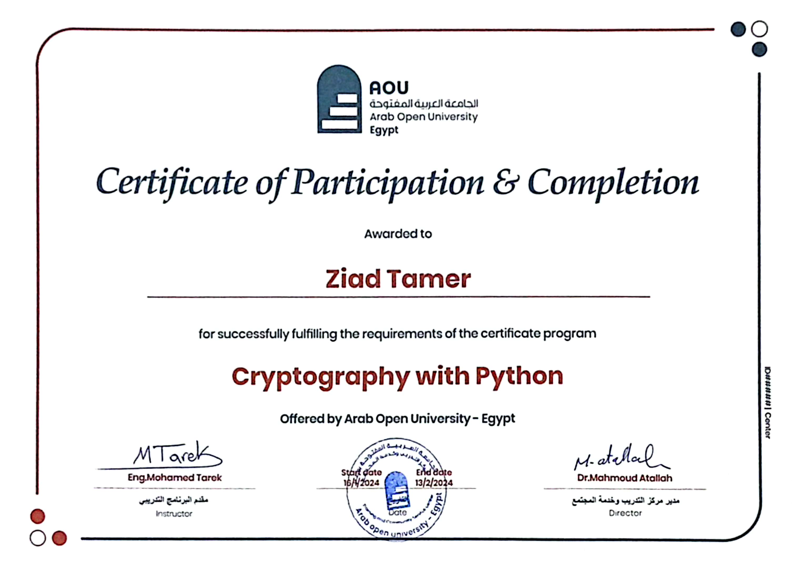

# Cryptography with Python Certificate - February 13, 2024

## About
This certificate was awarded to me for completing a course in *Cryptography with Python*.  
During this journey, I explored fundamental and advanced cryptographic techniques using Python programming.

## Skills Covered
- Symmetric Encryption (AES, DES)
- Asymmetric Encryption (RSA, ECC)
- Hashing Algorithms (SHA-256, MD5)
- Key Generation and Management
- Secure Communication Practices
- Python Programming for Security

## Certificate Date
- February 13, 2024
