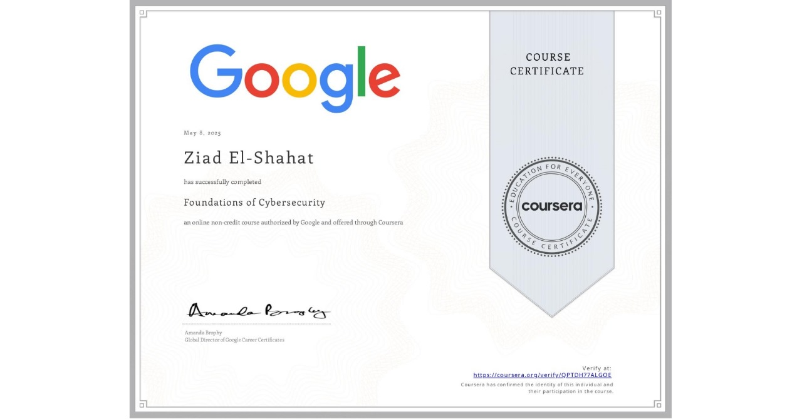

# Foundations of Cybersecurity Certificate - May 8,2025

## About
This certificate was awarded to me for completing the Foundations of Cybersecurity course by Google on Coursera.  
It marks the beginning of my journey into the field of cybersecurity, with a focus on ethical hacking and red teaming.

## Skills Covered
- CIA Triad: Confidentiality, Integrity, Availability  
- Types of Threats & Attacks  
- Security Domains and Layered Defense  
- Cybersecurity Tools and Best Practices  
- Career Pathways in Cybersecurity  
- Foundations for SOC & Red Teaming

## Certificate Date
- May 8,2025
