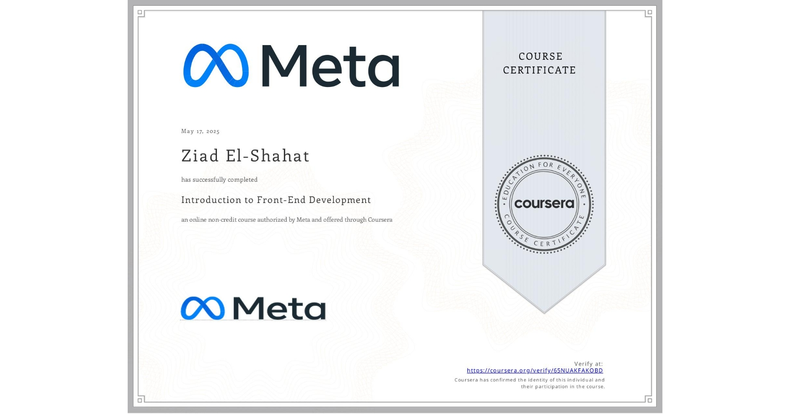

# Introduction to Front-End Development - May 17,2025

                                                           
Completed via Coursera | Issued by Meta

## Overview

This course offered a solid foundation in front-end web development, guiding me through the essential building blocks of the modern web. It marked the first step in my journey toward becoming a full-stack developer.

## Skills Acquired

- *HTML* – Structure and content of web pages
- *CSS* – Styling and layout principles
- *JavaScript* – Basics of interactivity and dynamic content
- *Responsive Design* – Mobile-first and adaptive design techniques
- *Developer Tools* – Intro to browser dev tools and best practices

## Why This Matters

This course helped me:
- Understand how websites are built from the ground up
- Grasp the basics of how dynamic content and servers interact
- Build responsive layouts that work across devices
- Feel confident in using developer tools to debug and optimize

## Next Steps

I'm now moving forward to:
- Build real-world projects (meme generator, portfolio, etc.)
- Explore frameworks like React
- Dive deeper into JavaScript and APIs

## Certificate Date

- May 17,2025

---

> “Every expert was once a beginner.” — Time to keep leveling up!
